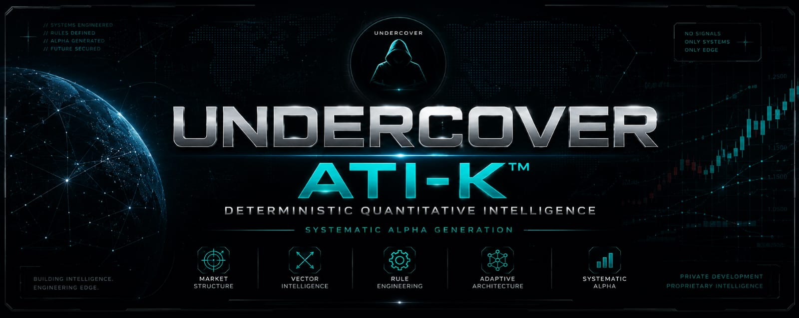

  

# UNDERCOVER

### Systematic Alpha Generation | Quantitative Architecture

Building deterministic, rule-based quantitative trading systems with a strong focus on market structure, vector physics, adaptive intelligence, and disciplined engineering.

---

## Current Focus

- UNDERCOVER ATI-K™
- Quantitative Research
- MQL5 Engineering
- Market Microstructure
- Vector Intelligence
- Algorithmic Trading Systems

---

## Engineering Principles

- Deterministic Logic
- Rule-Driven Architecture
- Modular System Design
- Validation Before Implementation
- Proprietary Research
- Long-Term Engineering Discipline

---

## Project Status

Primary architecture, engine development, and research repositories are maintained as **Private** to protect proprietary intellectual property.

The GitHub contribution graph reflects ongoing engineering and research activity.

---

## Technology

- MQL5
- MetaTrader 5
- Git
- GitHub
- Python
- Quantitative Research
- Algorithmic Trading

---

## Connect

https://www.linkedin.com/in/krishverase

---

Engineering proprietary quantitative intelligence  one deterministic rule at a time.
